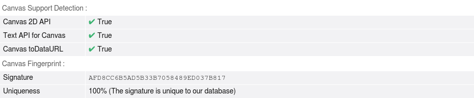
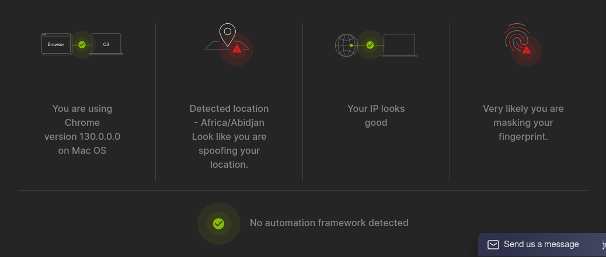

# PlaywrightStealth

Playwright Stealth is a Ruby gem that allows you to use Playwright with stealth mode. It patches Playwright to prevent detection.

## Installation

Install the gem and add to the application's Gemfile by executing:

```bash
bundle add playwright_stealth
```

If bundler is not being used to manage dependencies, install the gem by executing:

```bash
gem install playwright_stealth
```

## Usage

To use Playwright Stealth, require the gem in your Ruby script and initialize it as follows:

```ruby
require 'playwright_stealth'

PlaywrightStealth.browser('chromium', headless: true) do |_context, page|
	page.goto('https://bot.sannysoft.com')
	sleep(1)
	page.screenshot(path: 'results/intoli.png')
end
```

## Screenshots of Web Bot Detections
### ✅ Intoli


### ✅ Browserleaks


### 🟠 Pixelscan


## Development

After checking out the repo, run `bin/setup` to install dependencies. Then, run `rake spec` to run the tests. You can also run `bin/console` for an interactive prompt that will allow you to experiment.

To install this gem onto your local machine, run `bundle exec rake install`. To release a new version, update the version number in [`version.rb`](lib/playwright_stealth/version.rb), and then run `bundle exec rake release`, which will create a git tag for the version, push git commits and the created tag, and push the `.gem` file to [rubygems.org](https://rubygems.org).

## Contributing

Bug reports and pull requests are welcome on GitHub at https://github.com/Eth3rnit3/playwright_stealth. This project is intended to be a safe, welcoming space for collaboration, and contributors are expected to adhere to the [code of conduct](https://github.com/Eth3rnit3/playwright_stealth/blob/master/CODE_OF_CONDUCT.md).

## Acknowledgements

This gem was built with the help of the following projects:

- [playwright-ruby-client](https://github.com/YusukeIwaki/playwright-ruby-client)
- [undetected-chromedriver](https://github.com/ultrafunkamsterdam/undetected-chromedriver)
- [puppeteer-extra](https://github.com/berstend/puppeteer-extra)
- [playwright-stealth](https://github.com/Granitosaurus/playwright-stealth)

## License

The gem is available as open source under the terms of the [MIT License](https://opensource.org/licenses/MIT).

## Code of Conduct

Everyone interacting in the PlaywrightStealth project's codebases, issue trackers, chat rooms and mailing lists is expected to follow the [code of conduct](https://github.com/Eth3rnit3/playwright_stealth/blob/master/CODE_OF_CONDUCT.md).
